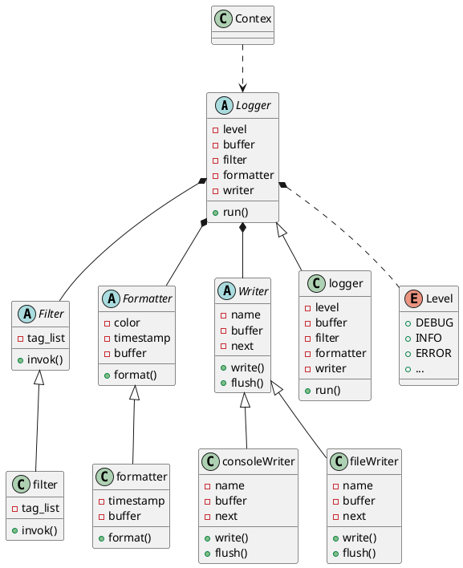
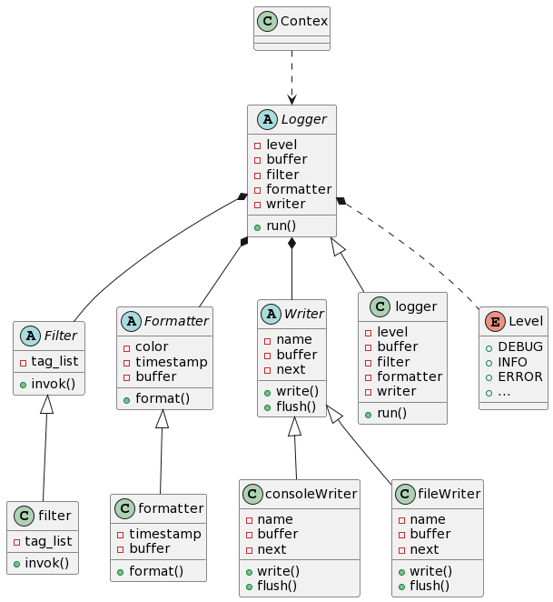
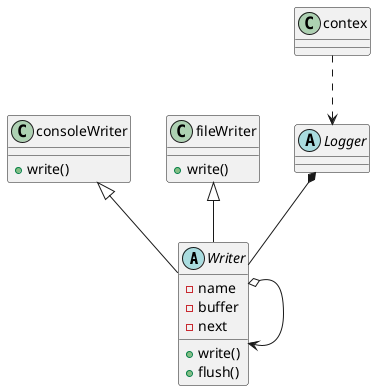

## `Q`uick `log`

`qlog` 是一个小型的 `c` 语言日志库，能够在资源紧张的嵌入式设备中近乎无损性能地运行。长期以来，笔者接触过的嵌入式项目中都缺少一个功能相对完善的日志模块，甚至多数情况下都是使用原生的打印接口，日志没有条理，直接导致回溯问题时工作效率低下。而嵌入式日志库的实现为了性能必然不能支持太多功能，也无法使用太过复杂的设计，接口实现也要尽量简单。`qlog`正是在这样的背景下应运而生！  

### 需求

> 在当下的嵌入式项目中，在几乎不影响性能的基础下，一个功能相对完备的日志系统面临的需求主要有以下这么几条：
- 支持打印等级设置，不同等级`log` 输出不同 `颜色`
- 支持子模块日志过滤功能，即只输出被允许的模块日志
- 支持动态开关日志输出
- 支持多种日志输出方式：控制台（串口）、文件等
- 日志上下文记录完备，不会被截断等
- 接口简单，易操作，输出日志如 `printf` 一样简洁

### 设计思路

`qlog` 虽然是用 `c` 语言实现，但是设计之初就确定了使用 `oop` 的思想建立抽象模型。因此，整体的 `qlog` 即 `logger` 由 `filter`、`formatter`、`writer` 三个抽象接口组成，硬要往`oop`上靠的话，就是满足所谓的 **依赖注入**，即`filter`、`formatter`、`writer`三个（底层）接口的具体实现由外部构造，以引用的形式传递给 `logger`（高层），实现了所谓的“依赖抽象，而非具体实现”，从而实现 “松耦合”。

<!--  -->

`filter` 负责过滤子模块的日志，其主要功能是：
- 如果当前日志没有标签，则按照打印等级输出。
- 如果当前日志设有标签，且与当前过滤列表里面的标签匹配，则按照打印级别输出，否则不输出。

`formatter` 负责对日志输出进行格式化操作，主要包括：
- 根据当前日志的打印等级加上打印等级标识
- 根据日志接口的调用信息，加上当前调用时的文件名、函数名、行号信息
- ~~加上当前日志接口调用时的线程信息、线程名、线程号等~~
- 如果支持带颜色输出，则此条日志前后加上 `CSI` 颜色格式前后缀
- 如果支持时间戳输出，则此条日志前缀应该附上时间戳
- 如果此条日志带有标签，则应加上标签

`writer` 的实现方式整体类似 `23` 种设计模式里的 **责任链模式**，`writer` 是抽象接口，具体的`writer`实现用链表链接，一个`writer`处理完之后交给其后继`writer`处理，尽管概念稍有不同，但如果用类图表示，相似度极高。
<!--  -->

### 已实现或待实现的特性
- [x] 支持全局打印等级
- [x] 为子模块加上标签，可根据标签进行日志过滤
- [x] 标签的打印等级以全局等级为准
- [x] 支持多种日志输出方式，控制台(默认支持)、文件等
- [x] 可自定义日志输出，需实现 `writer` 接口
- [ ] 线程安全，支持异步输出

### 使用细则
`qlog` 作为日志库，使用时可以将源码直接编译链接进可执行程序中去，也可以在支持 `linux` 的嵌入式设备中以动态库的形式在运行时进行链接。具体细节请参考 `demo`。

