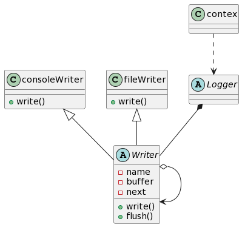

## `Q`uick `log`: A small log component for embedded devices

**English** ｜ [中文](README.md)  

---
>`qlog` is a small `C` logging library, It's designed to operate with near-lossless performance in resource-constrained embedded devices.

### Background
Since I was employed, the projects I have participated in have lacked a relatively complete log module, and even in some cases directly use the native `printf`. As we all know, If the logs in the program are not organized, it directly leads to inefficient work when backtracking bugs.

Although many well-known third-party libraries have full functions and rely on many things, in addition to the cost of porting, the performance on embedded devices is also a concern.

In order to ensure performance, the log library must not support too many features, nor can it use too complex design, and the interface implementation should be as simple as possible. It is in this contex that `qlog` came into being!

--- 
### Requirements

> In today's embedded devices, with little performance impace, the requirements of a relatively complete logging module are mainly as follows:

- Supports printing level setting, different levels of log can carry different colors.
- Supports module log filtering, that is, only allowed module logs are output.
- Supports dynamically enabling or disabling log output
- Supports multiple log output methods: console (serial port), file, etc.
- The log contex is well recorded, will not be truncated.
- The interface is simple and easy to operate, and the output log is as concise as `printf`.

### Design

Although `qlog` is implemented in 
`C`, it was designed to use the idea of `oop` to build an abstract model. Therefore, the overall `qlog` or `logger` consists of three abstract interfaces: `filter`, `formatter`, `writter`. In `oop` terms, it satisfies the so-called **dependency injection**, that is, the concrete implementation of the three (low-level) interfaces of `filter`, `formatter`, `writter` is constructed externally and passed to `logger` (high-level) in the form of references, realizing the so-called "rely on abstraction, not concrete implementation" to achieve "loose coupling".

`filter` is responsible for filtering the logs of modules, and its main functions are:

- If the current log does not have tags, it is output at the print level.
- If the current log is tagged and matches the tag in the current filter list, it will be output according to the print level, otherwise it will not be output.

`formatter` is responsible for formatting log output, mainly including:

- The print level is marked according to the print level of the current log.
- Add the file name, function name, and line number to the log when the current log API is called.
- ~~Add the thread information to the log when the current log API is called.~~
- If output log with color is supported, this log will be marked with the `CSI` codes.
- If output log wiht timestamp is supported, the timestamp will be added to the log.
- If current log is tagged, the tag name will be added to the log.

The implementation of `writer` is similar to the "chain of responsibility pattern" in the `23` design patterns. `writer` is an abstract interface, the concrete `writer` is linked to a linked list, A 'writer' is processed and handed over to its successor 'writer', and although the concept is slightly different, if it is represented by a class diagram, the similarity is very high.

### Features
- [x] Global print levels are supported.
- [x] filter logs based on tags.
- [x] The printing level of the tag is based on the global level.
- [x] Supports multiple log output methods, such as console (supported by default), and file.
- [x] The log output can be customized and the `writer` needs to be implemented.
- [ ] Thread-safe and supports asynchronous output. 

### Source code structure

> Platform independent

|source file | description |
|--|--|
| mempool.c | A simple memory pool is implemented to request fixed-size memory|
|qlog_api.c|Simple implementation of upper-level api |
|qlog_fileWriter.c|Implementation of log file export|
|qlog_c| The core implementation of `qlog` includes log filters, formatters, default serial output, etc|

> Platform dependent

|source file | description |
|--|--|
|qlog_port.c| Platform-dependent code |

### Terms of Use
As a logging library, `qlog` can be compiled and linked directly into the executable program, or it can be linked at runtime as a dynamic library in embedded devices that support `Linux`.

Please refer to `Makefile` && `demo` for details.

